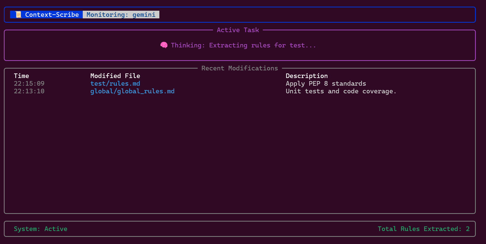

# 📜 Context-Scribe

**Context-Scribe** is a "Persistent Secretary" daemon designed to eliminate "Agent Amnesia." It monitors local AI session logs in the background, extracts long-term behavioral rules and project constraints, and professionally persists them to a centralized Memory Bank via the Model Context Protocol (MCP).



## 🚀 Core Features

*   **🔄 Zero-Touch Sync**: Automatically extracts and persists rules natively from chat logs, entirely out of band.
*   **📂 Project-Aware Routing**: Intelligently detects the active project context and routes rules to either `global/global_rules.md` or `[project-name]/rules.md`.
*   **⚖️ Strength Hierarchy**: Enforces a "Project > Global" hierarchy. Project-specific rules always take precedence over global ones.
*   **🧠 Intelligent Enhancement**: Does not just copy-paste; the system professionalizes slang (e.g., "spongebob typing" -> "alternating uppercase") and adds concrete code examples.
*   **🏗️ Semantic Categorization**: Automatically organizes your Memory Bank into logical Markdown sections like `# Style`, `# Architecture`, and `# Personal`.
*   **🛡️ Conflict Resolution**: Implements "New-Trumps-Old" logic to autonomously resolve contradictions within the same scope.
*   **⚡ Ultra-Fast Evaluation**: Uses optimized, extension-free headless calls to `gemini-2.5-flash-lite` for near-instant extraction.

## 🗣️ Natural Interaction

Context-Scribe is designed to be invisible. You **do not** need to use special "Rule" prefixes or commands. Simply interact with your AI agent as you normally would:

*   *"I prefer using single quotes for Python strings."*
*   *"My name is Joao and I'm a senior engineer."*
*   *"For this specific project, let's use Tailwind for styling."*

The Evaluator will autonomously detect that these are long-term preferences, professionalize them, and commit them to your Memory Bank in the background.

## 🏗️ Architecture

Context-Scribe operates on an **Observer-Evaluator-Bridge** pattern. See the [full architecture diagram and workflow details](docs/architecture.md) for more information.

1.  **Observer**: A robust `watchdog` powered log monitor with manual periodic scanning ensuring zero missed events across various Gemini log formats.
2.  **Evaluator**: Headless evaluation powered by your local `gemini` CLI (no extra API keys required).
3.  **Bridge**: Direct MCP integration syncing data into `@allpepper/memory-bank-mcp`.

## 🤖 Supported AI Tools

> [!IMPORTANT]
> **Gemini CLI and Cursor are supported.**
> 
> Context-Scribe now includes a Cursor observer that polls Cursor's local SQLite state databases, extracts user prompts from both global and workspace chat state, and routes the resulting rules through the same evaluator and MCP bridge. The provider pattern still makes it straightforward to add more tools later.

## 📋 Prerequisites

*   **Python 3.10+**
*   **Gemini CLI**: The daemon uses your local `gemini` CLI installation for headless evaluation.
*   **Memory Bank MCP**: Your AI tool **must** have the `@allpepper/memory-bank-mcp` server configured.

## 🛠️ Installation & Setup

1.  **Clone and Enter:**
    ```bash
    git clone https://github.com/Joaolfelicio/context-scribe.git
    cd context-scribe
    ```

2.  **Environment & Dependencies:**
    ```bash
    python3 -m venv .venv
    source .venv/bin/activate
    pip install -e ".[test]"
    ```

## 📖 Usage

### 1. Simple Mode (Recommended)
Start the daemon using the default Memory Bank location (`~/.memory-bank`):
```bash
context-scribe --tool gemini
```

### 2. Cursor Mode
Monitor Cursor's local chat state instead of Gemini logs:
```bash
context-scribe --tool cursor
```

By default the Cursor provider polls:

* `~/Library/Application Support/Cursor/User/globalStorage/state.vscdb`
* `~/Library/Application Support/Cursor/User/workspaceStorage/*/state.vscdb`

It reads `cursorDiskKV` entries like `composerData` plus workspace `ItemTable` entries such as `aiService.prompts` and `workbench.panel.aichat.view.aichat.chatdata`, then forwards fresh user-authored prompts into the evaluator pipeline.

### 3. Custom Memory Bank Location
If your AI tool's MCP server is configured to use a non-default root directory, you **must** pass that path to Context-Scribe:
```bash
context-scribe --tool gemini --bank-path "/path/to/your/custom-bank"
```

> [!CAUTION]
> **Path Consistency is Mandatory**: The value you provide to `--bank-path` (or the default `~/.memory-bank`) **must exactly match** the `MEMORY_BANK_ROOT` environment variable set in your AI tool's MCP settings (e.g., in your `~/.gemini/settings.json`). If these paths do not match, the agent will not be able to find the rules Context-Scribe saves.

## 🧪 Testing

We maintain a high standard of quality with a **hard requirement of at least 80% code coverage**.

### Running Automated Tests
```bash
pytest --cov=context_scribe tests/
```

### Manual Interaction Test

1.  **Start the daemon**: `context-scribe --tool gemini`

2.  **Simulate an interaction**: 
    ```bash
    echo '[{"role": "user", "content": "Rule: Always use single quotes for Python strings."}]' > ~/.gemini/tmp/test_rule.json
    ```
    
3.  **Verify Result**: Check your configured Memory Bank folder (e.g., `~/.memory-bank/global/global_rules.md`). You should see the rule professionally enhanced and categorized.
