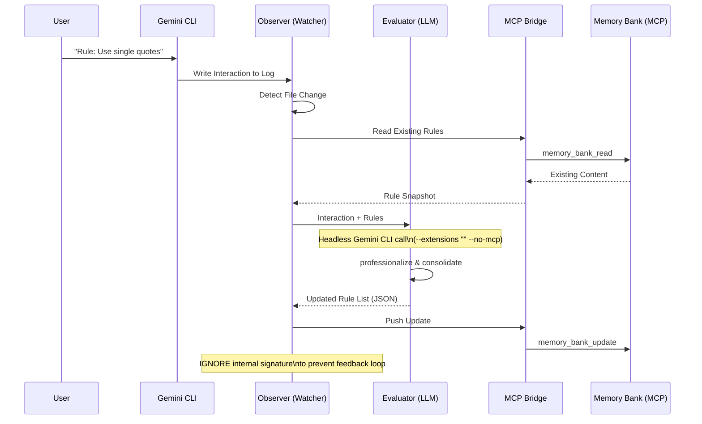

# Context-Scribe Architecture

The following diagram illustrates the data flow and component interactions within Context-Scribe.

## Key Workflow Steps

1.  **Ingestion**: The **Observer** monitors the filesystem for any `.json` updates in the Gemini temporary directories.
2.  **Snapshotting**: To avoid file-locking issues, the Observer creates a temporary copy (`.snapshot`) of the log.
3.  **Isolation**: The **Evaluator** performs a non-interactive, headless call to the Gemini CLI. It explicitly disables all extensions and MCP servers to ensure speed and prevent recursive tool calls.
4.  **Loop Prevention**: Every internal evaluation prompt contains a unique signature. The Observer identifies this signature and ignores these messages, breaking the recursive feedback loop.
5.  **Persistence**: The **Bridge** uses the Model Context Protocol to fetch the current bank state, merge the new rules, and push the unified state back to the corresponding project folder.
